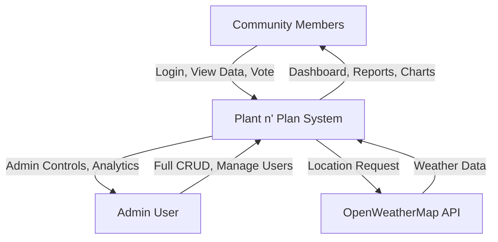

# Plant n' Plan - Data Flow Diagram (DFD) Documentation

## Table of Contents
1. [Context Diagram (Level 0)](#context-diagram-level-0)
2. [Level 1 DFD - Main System Processes](#level-1-dfd---main-system-processes)
3. [Level 2 DFD - Detailed Process Flows](#level-2-dfd---detailed-process-flows)
4. [Data Stores](#data-stores)
5. [External Entities](#external-entities)
6. [Data Flow Descriptions](#data-flow-descriptions)

---

## Context Diagram (Level 0)

### Overview
The highest-level view showing the Plant n' Plan system as a single process interacting with external entities.

### External Entities
1. **Community Members** (Regular Users)
2. **Barangay Administrator** (Admin User)
3. **OpenWeatherMap API** (External Service)
4. **Supabase Auth Service** (Authentication Provider)

### Main Data Flows

**Inputs to System:**
- User credentials (login/registration)
- Crop information
- Harvest records
- Budget transactions
- Volunteer task details
- Photo uploads
- Community feedback & poll votes
- Location coordinates

**Outputs from System:**
- Dashboard analytics
- Crop status reports
- Harvest summaries
- Budget visualizations
- Volunteer schedules
- Weather forecasts
- Community announcements
- User profile data

---

## Level 1 DFD - Main System Processes

### Process 1: User Authentication & Authorization
**Inputs:**
- Email and password from users
- Registration details (name, email, password)

**Processes:**
- Validate user credentials via Supabase Auth
- Create new user accounts
- Establish user sessions
- Verify admin privileges (francisjohngorres@gmail.com)
- Manage user sessions and tokens

**Outputs:**
- Authentication tokens (access_token)
- User session data
- Admin role indicators
- Error messages (invalid credentials)

**Data Stores Used:**
- Supabase Auth Database
- KV Store (user_data_a8901673)

**Files Involved:**
- `/utils/auth.ts` - Authentication logic
- `/components/UserRegistration.tsx` - Registration UI
- `/components/LandingPage.tsx` - Login UI
- `/supabase/functions/server/index.tsx` - Server-side auth routes

---

### Process 2: Crop Management
**Inputs:**
- Crop name, planting date, expected harvest date
- Health indicators (Healthy, Needs Attention, Critical)
- Growth stage (Seedling, Growing, Mature, Harvested)
- Status updates

**Processes:**
- Create new crop records (Admin only)
- Update crop health and growth status
- Track planting to harvest lifecycle
- Calculate days until harvest
- Filter and search crops by status/health

**Outputs:**
- Crop listings with status indicators
- Health statistics for dashboard
- Planting schedule data
- Search/filter results

**Data Stores Used:**
- `crops_a8901673` (KV Store key prefix)

**Files Involved:**
- `/components/CropsManagement.tsx` - CRUD UI
- `/components/Dashboard.tsx` - Display summaries
- `/utils/api.ts` - API calls to server
- `/supabase/functions/server/index.tsx` - Server routes: `/make-server-a8901673/crops`

**Data Flow:**
```
Admin → CropsManagement.tsx → api.ts → Server (POST /crops) → KV Store → Response → UI Update
User → CropsManagement.tsx → api.ts → Server (GET /crops) → KV Store → Crop List Display
```

---

### Process 3: Harvest Tracking
**Inputs:**
- Crop selection (from existing crops)
- Harvest date
- Quantity harvested (kg)
- Quality rating (Excellent, Good, Fair, Poor)

**Processes:**
- Record harvest events
- Link harvests to specific crops
- Calculate total yield statistics
- Generate harvest history reports
- Update crop status to "Harvested"

**Outputs:**
- Harvest records with timestamps
- Total yield calculations
- Quality distribution statistics
- Harvest history tables

**Data Stores Used:**
- `harvests_a8901673` (KV Store key prefix)
- `crops_a8901673` (reference for crop names)

**Files Involved:**
- `/components/HarvestTracker.tsx` - CRUD UI
- `/components/Dashboard.tsx` - Display recent harvests
- `/utils/api.ts` - API communications
- `/supabase/functions/server/index.tsx` - Server routes: `/make-server-a8901673/harvests`

**Data Flow:**
```
Admin → HarvestTracker.tsx → Select Crop from Dropdown → api.ts → 
Server (POST /harvests) → KV Store → Dashboard Update → Statistics Recalculation
```

---

### Process 4: Budget Transparency
**Inputs:**
- Transaction description
- Category (Seeds, Equipment, Water, Fertilizer, Labor, Harvest Sales)
- Amount (PHP)
- Transaction type (Income/Expense)
- Date

**Processes:**
- Record financial transactions
- Categorize budget items
- Calculate totals by category
- Generate pie charts (expense distribution)
- Generate bar charts (monthly trends)
- Compute balance (income - expenses)

**Outputs:**
- Transaction list with search/filter
- Pie chart visualization (by category)
- Bar chart visualization (monthly breakdown)
- Total income, expenses, and balance
- Export-ready financial data

**Data Stores Used:**
- `budget_a8901673` (KV Store key prefix)

**Files Involved:**
- `/components/BudgetTransparency.tsx` - CRUD UI + Recharts visualizations
- `/components/Dashboard.tsx` - Budget summary card
- `/utils/api.ts` - API layer
- `/supabase/functions/server/index.tsx` - Server routes: `/make-server-a8901673/budget`

**Data Flow:**
```
Admin → BudgetTransparency.tsx → Form Input → api.ts → Server (POST /budget) → 
KV Store → Response → Recharts Data Processing → Chart Rendering

Community Member → BudgetTransparency.tsx → api.ts → Server (GET /budget) → 
KV Store → Transaction List + Charts (Read-Only View)
```

---

### Process 5: Volunteer Management
**Inputs:**
- Volunteer name
- Task description
- Assigned date
- Task status (Pending, In Progress, Completed)

**Processes:**
- Create volunteer task assignments
- Update task status
- Filter tasks by status
- Track volunteer participation
- Schedule management

**Outputs:**
- Task lists with status indicators
- Upcoming volunteer schedules
- Completed task history
- Dashboard task summaries

**Data Stores Used:**
- `volunteers_a8901673` (KV Store key prefix)

**Files Involved:**
- `/components/VolunteerManagement.tsx` - Task CRUD UI
- `/components/Dashboard.tsx` - Upcoming tasks display
- `/utils/api.ts` - API communications
- `/supabase/functions/server/index.tsx` - Server routes: `/make-server-a8901673/volunteers`

**Data Flow:**
```
Admin → VolunteerManagement.tsx → Create Task → api.ts → Server (POST /volunteers) → 
KV Store → Task List Update

Volunteer → VolunteerManagement.tsx → View Assigned Tasks → Update Status → 
api.ts → Server (PUT /volunteers/:id) → KV Store → Status Update Confirmation
```

---

### Process 6: Photo Gallery
**Inputs:**
- Image files (JPEG, PNG)
- Photo descriptions
- Upload timestamps

**Processes:**
- Upload photos to Supabase Storage
- Store metadata in database
- Generate signed URLs for display
- Organize photos by date
- Delete photos and storage files

**Outputs:**
- Photo grid display
- Image URLs (signed, secure)
- Photo metadata (description, date)
- Storage confirmations

**Data Stores Used:**
- `gallery_a8901673` (KV Store for metadata)
- `make-a8901673-gallery` (Supabase Storage bucket)

**Files Involved:**
- `/components/PhotoGallery.tsx` - Upload/display UI
- `/utils/api.ts` - API calls
- `/supabase/functions/server/index.tsx` - Server routes: `/make-server-a8901673/gallery`
  - Server handles Storage bucket creation
  - Server generates signed URLs

**Data Flow:**
```
Admin → PhotoGallery.tsx → File Input → api.ts → 
Server (POST /gallery/upload) → Supabase Storage (bucket creation if needed) → 
Store file → Generate signed URL → Save metadata to KV Store → 
Return URL → PhotoGallery.tsx → Display Image

User → PhotoGallery.tsx → api.ts → Server (GET /gallery) → 
KV Store + Signed URLs → Photo Grid Display
```

---

### Process 7: Weather Information
**Inputs:**
- User location (latitude, longitude) from browser geolocation
- Manual location settings (optional)
- API key from environment variables

**Processes:**
- Auto-detect user location via browser Geolocation API
- Fetch current weather from OpenWeatherMap API
- Parse weather data (temperature, humidity, wind, conditions)
- Auto-refresh every 15 minutes
- Track last updated timestamp
- Handle API errors gracefully

**Outputs:**
- Current temperature (°C)
- Weather conditions (Clear, Rainy, Cloudy, etc.)
- Humidity percentage
- Wind speed (m/s)
- Weather icon
- Last updated timestamp
- Location name

**Data Stores Used:**
- Browser localStorage (location preferences)
- Session state (weather data cache)

**Files Involved:**
- `/components/WeatherWidget.tsx` - UI display
- `/components/LocationSettings.tsx` - Location configuration
- `/utils/weather.ts` - API integration logic
- `/components/Dashboard.tsx` - Weather card display

**Data Flow:**
```
User Opens App → WeatherWidget.tsx → Check localStorage for saved location → 
If no location: Request browser geolocation → Get coordinates → 
weather.ts → OpenWeatherMap API (GET) → Parse JSON response → 
Display weather data → Set 15-minute interval → Auto-refresh

User Changes Location → LocationSettings.tsx → Enter coordinates → 
Save to localStorage → Trigger weather refresh → Update display
```

**External API Call:**
```
GET https://api.openweathermap.org/data/2.5/weather?lat={lat}&lon={lon}&appid={API_KEY}&units=metric
```

---

### Process 8: Community Engagement
**Inputs:**
- Poll questions and options (Admin)
- Poll votes (Community members)
- Feedback text submissions

**Processes:**
- Create community polls
- Collect and count votes
- Store feedback submissions
- Display poll results in real-time
- Show feedback list

**Outputs:**
- Active polls with voting interface
- Vote counts and percentages
- Feedback submissions list
- Community announcements

**Data Stores Used:**
- `polls_a8901673` (KV Store for polls)
- `feedback_a8901673` (KV Store for feedback)

**Files Involved:**
- `/components/CommunityEngagement.tsx` - Polls and feedback UI
- `/components/CommunityUpdates.tsx` - Announcements
- `/utils/api.ts` - API layer
- `/supabase/functions/server/index.tsx` - Server routes: `/make-server-a8901673/polls`, `/make-server-a8901673/feedback`

**Data Flow:**
```
Admin → CommunityEngagement.tsx → Create Poll → api.ts → 
Server (POST /polls) → KV Store → Poll Published

Community Member → View Poll → Cast Vote → api.ts → 
Server (POST /polls/:id/vote) → KV Store (increment vote count) → 
Updated Results Display

Community Member → Submit Feedback → api.ts → 
Server (POST /feedback) → KV Store → Confirmation Message
```

---

### Process 9: User Management (Admin)
**Inputs:**
- User search queries
- Profile updates
- Role assignments (future feature)

**Processes:**
- List all registered users
- Display user details (email, name, role)
- Identify admin users with visual indicators
- Enable/disable user accounts (future)
- Search and filter users

**Outputs:**
- User directory table
- Admin badges and indicators
- User profile data
- User statistics

**Data Stores Used:**
- Supabase Auth (user accounts)
- `user_data_a8901673` (KV Store for profile data)

**Files Involved:**
- `/components/UserManagement.tsx` - User directory UI
- `/components/ProfilePage.tsx` - Individual user profiles
- `/utils/api.ts` - API communications
- `/supabase/functions/server/index.tsx` - Server routes: `/make-server-a8901673/users`

**Data Flow:**
```
Admin → UserManagement.tsx → api.ts → Server (GET /users) → 
Supabase Auth (list users) + KV Store (profile data) → 
Merge data → User table display with admin indicators
```

---

### Process 10: Profile Management
**Inputs:**
- Profile picture uploads (images)
- User bio/description updates
- Personal information changes

**Processes:**
- Upload profile pictures to Supabase Storage
- Store profile metadata in database
- Generate signed URLs for avatar display
- Update user information
- Display profile across app (sidebar, comments, etc.)

**Outputs:**
- User avatars with golden glow for admins
- Profile information display
- Avatar URLs (signed, secure)
- Update confirmations

**Data Stores Used:**
- `make-a8901673-avatars` (Supabase Storage bucket)
- `user_data_a8901673` (KV Store for profile metadata)

**Files Involved:**
- `/components/ProfilePage.tsx` - Profile edit UI
- `/components/UserMenu.tsx` - Avatar display in header
- `/components/Sidebar.tsx` - Avatar in sidebar
- `/utils/api.ts` - API layer
- `/supabase/functions/server/index.tsx` - Server routes: `/make-server-a8901673/profile`

**Data Flow:**
```
User → ProfilePage.tsx → Upload Photo → api.ts → 
Server (POST /profile/upload-avatar) → Supabase Storage → 
Save file → Generate signed URL → Update user_data in KV Store → 
Return URL → Update UI across all components (Sidebar, UserMenu)
```

---

## Data Stores

### 1. Supabase Authentication Database
**Type:** Managed by Supabase Auth Service
**Contents:**
- User accounts (email, hashed passwords)
- Session tokens
- User metadata (name, created date)

**Access:**
- Read/Write via Supabase Auth API
- Server-side: SUPABASE_SERVICE_ROLE_KEY
- Client-side: SUPABASE_ANON_KEY

---

### 2. KV Store (PostgreSQL Table: kv_store_a8901673)
**Type:** Key-Value Store (PostgreSQL table)
**Structure:**
```
Table: kv_store_a8901673
Columns:
  - key (TEXT, PRIMARY KEY)
  - value (JSONB)
  - created_at (TIMESTAMP)
  - updated_at (TIMESTAMP)
```

**Data Organization by Key Prefixes:**
- `crops_a8901673:{id}` - Individual crop records
- `harvests_a8901673:{id}` - Harvest records
- `budget_a8901673:{id}` - Budget transactions
- `volunteers_a8901673:{id}` - Volunteer tasks
- `gallery_a8901673:{id}` - Photo metadata
- `polls_a8901673:{id}` - Community polls
- `feedback_a8901673:{id}` - Feedback submissions
- `user_data_a8901673:{userId}` - User profile data

**Access Methods:**
```typescript
// Server-side only
import * as kv from './kv_store.tsx'

// Functions available:
kv.get(key)           // Get single value
kv.set(key, value)    // Set single value
kv.del(key)           // Delete single value
kv.mget([keys])       // Get multiple values
kv.mset([{k, v}])     // Set multiple values
kv.mdel([keys])       // Delete multiple values
kv.getByPrefix(prefix)// Get all values with key prefix
```

**Files:**
- `/supabase/functions/server/kv_store.tsx` - Utility functions (PROTECTED)

---

### 3. Supabase Storage Buckets
**Type:** Object Storage for Files

**Buckets:**
1. `make-a8901673-gallery` - Photo gallery images
2. `make-a8901673-avatars` - User profile pictures

**Properties:**
- Private buckets (requires signed URLs)
- Auto-created by server on first upload
- File naming: `{timestamp}_{originalName}`

**Access:**
- Upload: Server-side with SERVICE_ROLE_KEY
- Retrieve: Signed URLs generated by server (valid for 1 hour)
- Delete: Server-side with SERVICE_ROLE_KEY

---

### 4. Browser Local Storage
**Type:** Client-side storage
**Contents:**
- Weather location preferences
- Dark mode toggle state
- Session caching (temporary)

**Access:**
- Client-side only via JavaScript
- Persistent across browser sessions

---

## External Entities

### 1. Community Members (Regular Users)
**Interactions:**
- Login/Register
- View all data (crops, harvests, budget, volunteers, gallery)
- Participate in polls
- Submit feedback
- View weather
- Update own profile

**Restrictions:**
- Cannot create/edit/delete data (read-only)
- Can only modify own profile and votes

---

### 2. Barangay Administrator
**Email:** francisjohngorres@gmail.com

**Interactions:**
- All Community Member capabilities
- Create/Edit/Delete crops
- Record harvests
- Manage budget transactions
- Assign volunteer tasks
- Upload photos
- Create polls and announcements
- View user directory
- Full CRUD on all data

**Visual Indicators:**
- Golden avatar glow
- Shield icon next to name
- Admin badge in user lists

---

### 3. OpenWeatherMap API
**Type:** External REST API
**Endpoint:** `https://api.openweathermap.org/data/2.5/weather`

**Request:**
```
GET /data/2.5/weather?lat={latitude}&lon={longitude}&appid={API_KEY}&units=metric
```

**Response:**
```json
{
  "name": "City Name",
  "main": {
    "temp": 28.5,
    "humidity": 75
  },
  "weather": [{
    "main": "Clear",
    "description": "clear sky",
    "icon": "01d"
  }],
  "wind": {
    "speed": 3.5
  }
}
```

**Usage:**
- Auto-refresh every 15 minutes
- Requires API key in environment variable: `OPENWEATHERMAP_API_KEY`

---

### 4. Supabase Backend Services
**Type:** Backend-as-a-Service (BaaS)

**Components:**
- **Auth Service:** User authentication and session management
- **PostgreSQL Database:** KV Store table
- **Storage Service:** File hosting for images
- **Edge Functions:** Hono web server hosting

**Configuration:**
- `SUPABASE_URL` - Project URL
- `SUPABASE_ANON_KEY` - Public anonymous key (client-side)
- `SUPABASE_SERVICE_ROLE_KEY` - Admin key (server-side only)

---

## Data Flow Descriptions

### Complete User Journey: Recording a Harvest

**Step-by-Step Flow:**

1. **Admin Login**
   ```
   User (Admin) → LandingPage.tsx → Enter credentials → 
   auth.ts (signIn function) → Supabase Auth API → 
   Validate credentials → Return session token → 
   Store in app state → Redirect to Dashboard
   ```

2. **Navigate to Harvest Tracker**
   ```
   Admin → Click "Harvest Tracker" in Sidebar → 
   Route to HarvestTracker.tsx → Component loads → 
   Fetch existing harvests and crops
   ```

3. **Fetch Available Crops**
   ```
   HarvestTracker.tsx → useEffect hook → api.ts (fetchCrops) → 
   HTTP GET request → Server (/make-server-a8901673/crops) → 
   kv.getByPrefix('crops_a8901673') → Return crop array → 
   Populate dropdown menu
   ```

4. **Admin Fills Form**
   ```
   Admin → Select crop from dropdown → 
   Enter harvest date (calendar picker) → 
   Enter quantity (number input) → 
   Select quality (dropdown) → 
   Click "Record Harvest" button
   ```

5. **Submit Harvest Record**
   ```
   HarvestTracker.tsx → handleSubmit function → 
   Validate form data → api.ts (createHarvest) → 
   HTTP POST to /make-server-a8901673/harvests → 
   Request body: { cropId, cropName, date, quantity, quality } → 
   Server receives request
   ```

6. **Server Processing**
   ```
   Server index.tsx → Route: POST /make-server-a8901673/harvests → 
   Verify authorization header → Extract harvest data → 
   Generate unique ID (Date.now()) → 
   Create harvest object with timestamp → 
   kv.set(`harvests_a8901673:${id}`, harvestData) → 
   Return success response with created harvest
   ```

7. **Update UI**
   ```
   Server response → api.ts receives data → 
   HarvestTracker.tsx → Update local state (setHarvests) → 
   Re-render table with new harvest → 
   Show success toast notification → 
   Reset form fields
   ```

8. **Dashboard Auto-Update**
   ```
   Dashboard.tsx → useEffect polls for data → 
   Fetch updated harvests → Recalculate statistics → 
   Update "Recent Harvests" card → 
   Update "Total Yield" metric
   ```

---

### Complete User Journey: Viewing Budget Transparency

**Step-by-Step Flow:**

1. **Community Member Access**
   ```
   User (Community Member) → Login → Dashboard → 
   Click "Budget" in Sidebar → Navigate to BudgetTransparency.tsx
   ```

2. **Fetch Budget Data**
   ```
   BudgetTransparency.tsx → useEffect hook → 
   api.ts (fetchBudget) → HTTP GET /make-server-a8901673/budget → 
   Server: kv.getByPrefix('budget_a8901673') → 
   Return all transactions → Sort by date (descending)
   ```

3. **Process Data for Visualization**
   ```
   BudgetTransparency.tsx → Receive transaction array → 
   Filter by type (income vs expense) → 
   Calculate totals:
     - totalIncome = sum of income transactions
     - totalExpenses = sum of expense transactions
     - balance = totalIncome - totalExpenses
   
   Group by category for pie chart:
     - Seeds: PHP 5000
     - Equipment: PHP 8000
     - Fertilizer: PHP 3000
     - etc.
   
   Group by month for bar chart:
     - January: PHP 15000
     - February: PHP 12000
     - etc.
   ```

4. **Render Visualizations**
   ```
   BudgetTransparency.tsx → Recharts components → 
   
   PieChart:
     - Data: categoryTotals array
     - Display: Category distribution
     - Colors: Different color for each category
   
   BarChart:
     - Data: monthlyTotals array
     - Display: Income vs Expenses per month
     - Tooltip: Show exact amounts on hover
   ```

5. **Display Results**
   ```
   UI Rendering:
     - Transaction table (searchable/filterable)
     - Summary cards (Total Income, Total Expenses, Balance)
     - Pie chart (Expense by Category)
     - Bar chart (Monthly Trends)
     - All data read-only for community members
     - Admin sees additional "Add Transaction" button
   ```

---

### System Initialization Flow

**When Application First Starts:**

1. **App Initialization**
   ```
   User opens browser → Navigate to Plant n' Plan URL → 
   Load App.tsx → Initialize React application → 
   Load globals.css (Tailwind styles)
   ```

2. **Check Authentication**
   ```
   App.tsx → useEffect → auth.ts (checkSession) → 
   Supabase.auth.getSession() → 
   
   If session exists:
     → Set authenticated state → Load Dashboard
   
   If no session:
     → Show LandingPage.tsx (login screen)
   ```

3. **Initialize Weather**
   ```
   Dashboard loads → WeatherWidget.tsx → 
   Check localStorage for saved location → 
   
   If no location:
     → Request browser geolocation → 
     → navigator.geolocation.getCurrentPosition() → 
     → Get coordinates → Save to localStorage
   
   weather.ts → Fetch weather from OpenWeatherMap → 
   Display results → Set 15-minute refresh interval
   ```

4. **Load Dashboard Data**
   ```
   Dashboard.tsx → Multiple parallel API calls:
   
   Promise.all([
     api.fetchCrops(),
     api.fetchHarvests(),
     api.fetchBudget(),
     api.fetchVolunteers()
   ]) → All requests to server → 
   Server queries KV Store for each → 
   Return aggregated data → 
   Dashboard calculates statistics → 
   Render cards and summaries
   ```

5. **Initialize Server (First Request)**
   ```
   First API call → Server cold start → 
   /supabase/functions/server/index.tsx → 
   
   Initialize Supabase client:
     - SUPABASE_URL from env
     - SUPABASE_SERVICE_ROLE_KEY from env
   
   Check Storage buckets:
     - List existing buckets
     - Create 'make-a8901673-gallery' if not exists
     - Create 'make-a8901673-avatars' if not exists
   
   Setup routes (Hono app):
     - /make-server-a8901673/crops
     - /make-server-a8901673/harvests
     - /make-server-a8901673/budget
     - /make-server-a8901673/volunteers
     - /make-server-a8901673/gallery
     - /make-server-a8901673/polls
     - /make-server-a8901673/feedback
     - /make-server-a8901673/users
     - /make-server-a8901673/profile
   
   Enable CORS → Apply middleware → 
   Start server: Deno.serve(app.fetch)
   ```

---

## Data Flow Summary Tables

### Frontend → Server Communication

| Component | HTTP Method | Endpoint | Purpose | Auth Required |
|-----------|-------------|----------|---------|---------------|
| UserRegistration.tsx | POST | /make-server-a8901673/signup | Create new user | No |
| LandingPage.tsx | POST | N/A (Supabase Auth) | User login | No |
| CropsManagement.tsx | GET | /make-server-a8901673/crops | Fetch all crops | Yes |
| CropsManagement.tsx | POST | /make-server-a8901673/crops | Create new crop | Yes (Admin) |
| CropsManagement.tsx | PUT | /make-server-a8901673/crops/:id | Update crop | Yes (Admin) |
| CropsManagement.tsx | DELETE | /make-server-a8901673/crops/:id | Delete crop | Yes (Admin) |
| HarvestTracker.tsx | GET | /make-server-a8901673/harvests | Fetch all harvests | Yes |
| HarvestTracker.tsx | POST | /make-server-a8901673/harvests | Create harvest record | Yes (Admin) |
| BudgetTransparency.tsx | GET | /make-server-a8901673/budget | Fetch budget data | Yes |
| BudgetTransparency.tsx | POST | /make-server-a8901673/budget | Add transaction | Yes (Admin) |
| VolunteerManagement.tsx | GET | /make-server-a8901673/volunteers | Fetch tasks | Yes |
| VolunteerManagement.tsx | POST | /make-server-a8901673/volunteers | Create task | Yes (Admin) |
| PhotoGallery.tsx | GET | /make-server-a8901673/gallery | Fetch photos | Yes |
| PhotoGallery.tsx | POST | /make-server-a8901673/gallery/upload | Upload photo | Yes (Admin) |
| CommunityEngagement.tsx | GET | /make-server-a8901673/polls | Fetch polls | Yes |
| CommunityEngagement.tsx | POST | /make-server-a8901673/polls | Create poll | Yes (Admin) |
| CommunityEngagement.tsx | POST | /make-server-a8901673/polls/:id/vote | Cast vote | Yes |
| CommunityEngagement.tsx | POST | /make-server-a8901673/feedback | Submit feedback | Yes |
| UserManagement.tsx | GET | /make-server-a8901673/users | List all users | Yes (Admin) |
| ProfilePage.tsx | GET | /make-server-a8901673/profile/:id | Get user profile | Yes |
| ProfilePage.tsx | POST | /make-server-a8901673/profile/upload-avatar | Upload avatar | Yes |

---

### Server → Database/Storage Operations

| Server Route | Operation | Data Store | Action |
|--------------|-----------|------------|--------|
| POST /signup | Write | Supabase Auth | supabase.auth.admin.createUser() |
| GET /crops | Read | KV Store | kv.getByPrefix('crops_a8901673') |
| POST /crops | Write | KV Store | kv.set('crops_a8901673:{id}', data) |
| DELETE /crops/:id | Delete | KV Store | kv.del('crops_a8901673:{id}') |
| POST /gallery/upload | Write | Supabase Storage | supabase.storage.bucket().upload() |
| POST /gallery/upload | Write | KV Store | kv.set('gallery_a8901673:{id}', metadata) |
| GET /gallery | Read | KV Store + Storage | getByPrefix() + createSignedUrl() |
| POST /profile/upload-avatar | Write | Supabase Storage | supabase.storage.bucket().upload() |
| POST /profile/upload-avatar | Write | KV Store | kv.set('user_data_a8901673:{userId}', profile) |

---

### External API Calls

| Component | External Service | Method | Endpoint | Frequency |
|-----------|------------------|--------|----------|-----------|
| WeatherWidget.tsx | OpenWeatherMap | GET | /data/2.5/weather | Every 15 minutes |
| LandingPage.tsx | Supabase Auth | POST | /auth/v1/token | On login |
| UserRegistration.tsx | Supabase Auth (via Server) | POST | /auth/v1/admin/users | On signup |

---

## Architectural Diagram (Text Representation)

```
┌─────────────────────────────────────────────────────────────────────┐
│                         EXTERNAL ENTITIES                           │
├─────────────────────────────────────────────────────────────────────┤
│  Community Members  │  Admin User  │  OpenWeatherMap API            │
└──────────┬──────────┴──────┬───────┴────────────────┬───────────────┘
           │                 │                        │
           │ Login/Register  │  CRUD Operations       │ Weather Data
           │ View Data       │  Full Access           │
           │ Vote/Feedback   │  User Management       │
           │                 │                        │
           ▼                 ▼                        ▼
┌─────────────────────────────────────────────────────────────────────┐
│                         PRESENTATION LAYER                          │
│                         (React + TypeScript)                        │
├─────────────────────────────────────────────────────────────────────┤
│  App.tsx (Router)                                                   │
│  ├── LandingPage.tsx (Login/Register)                              │
│  ├── Dashboard.tsx (Overview)                                       │
│  ├── CropsManagement.tsx                                            │
│  ├── HarvestTracker.tsx                                             │
│  ├── BudgetTransparency.tsx (Recharts)                              │
│  ├── VolunteerManagement.tsx                                        │
│  ├── PhotoGallery.tsx                                               │
│  ├── CommunityEngagement.tsx                                        │
│  ├── WeatherWidget.tsx                                              │
│  ├── UserManagement.tsx (Admin only)                                │
│  └── ProfilePage.tsx                                                │
└──────────────────────────┬──────────────────────────────────────────┘
                           │
                           │ API Calls
                           │
                           ▼
┌─────────────────────────────────────────────────────────────────────┐
│                      APPLICATION LOGIC LAYER                        │
├─────────────────────────────────────────────────────────────────────┤
│  /utils/api.ts          │  HTTP requests to server                 │
│  /utils/auth.ts         │  Authentication logic                    │
│  /utils/weather.ts      │  Weather API integration                 │
│  /utils/initializeData.ts│ Data initialization utilities           │
└──────────────────────────┬──────────────────────────────────────────┘
                           │
                           │ HTTPS Requests
                           │ Bearer Token Auth
                           ▼
┌─────────────────────────────────────────────────────────────────────┐
│                         SERVER LAYER                                │
│                  (Supabase Edge Function - Hono)                    │
├─────────────────────────────────────────────────────────────────────┤
│  /supabase/functions/server/index.tsx                              │
│                                                                     │
│  Routes:                                                            │
│    POST   /make-server-a8901673/signup                              │
│    GET    /make-server-a8901673/crops                               │
│    POST   /make-server-a8901673/crops                               │
│    PUT    /make-server-a8901673/crops/:id                           │
│    DELETE /make-server-a8901673/crops/:id                           │
│    GET    /make-server-a8901673/harvests                            │
│    POST   /make-server-a8901673/harvests                            │
│    GET    /make-server-a8901673/budget                              │
│    POST   /make-server-a8901673/budget                              │
│    GET    /make-server-a8901673/volunteers                          │
│    POST   /make-server-a8901673/volunteers                          │
│    GET    /make-server-a8901673/gallery                             │
│    POST   /make-server-a8901673/gallery/upload                      │
│    GET    /make-server-a8901673/polls                               │
│    POST   /make-server-a8901673/polls                               │
│    POST   /make-server-a8901673/feedback                            │
│    GET    /make-server-a8901673/users                               │
│    GET    /make-server-a8901673/profile/:id                         │
│    POST   /make-server-a8901673/profile/upload-avatar               │
│                                                                     │
│  Middleware: CORS, Logger, Error Handler                            │
└──────────────────────────┬────────────────────────┬─────────────────┘
                           │                        │
                           │ Database Queries       │ File Operations
                           │                        │
                           ▼                        ▼
┌──────────────────────────────────────┐ ┌─────────────────────────────┐
│         DATA LAYER                   │ │    STORAGE LAYER            │
│    (Supabase PostgreSQL)             │ │  (Supabase Storage)         │
├──────────────────────────────────────┤ ├─────────────────────────────┤
│  Table: kv_store_a8901673            │ │  Bucket: make-a8901673-     │
│                                      │ │          gallery            │
│  Key Prefixes:                       │ │  Files: Gallery photos      │
│    - crops_a8901673:{id}             │ │                             │
│    - harvests_a8901673:{id}          │ │  Bucket: make-a8901673-     │
│    - budget_a8901673:{id}            │ │          avatars            │
│    - volunteers_a8901673:{id}        │ │  Files: User profile pics   │
│    - gallery_a8901673:{id}           │ │                             │
│    - polls_a8901673:{id}             │ │  Access: Signed URLs        │
│    - feedback_a8901673:{id}          │ │  (1 hour expiration)        │
│    - user_data_a8901673:{userId}     │ │                             │
│                                      │ │                             │
│  Access via kv_store.tsx:            │ │                             │
│    - kv.get(key)                     │ │                             │
│    - kv.set(key, value)              │ │                             │
│    - kv.getByPrefix(prefix)          │ │                             │
└──────────────────────────────────────┘ └─────────────────────────────┘

┌─────────────────────────────────────────────────────────────────────┐
│                    AUTHENTICATION LAYER                             │
│                      (Supabase Auth)                                │
├─────────────────────────────────────────────────────────────────────┤
│  - User accounts database                                           │
│  - Session management                                               │
│  - JWT token generation                                             │
│  - Email verification (auto-confirmed)                              │
│  - Admin role detection (francisjohngorres@gmail.com)               │
└─────────────────────────────────────────────────────────────────────┘

┌─────────────────────────────────────────────────────────────────────┐
│                    CLIENT-SIDE STORAGE                              │
├─────────────────────────────────────────────────────────────────────┤
│  Browser localStorage:                                              │
│    - Weather location preferences                                   │
│    - Dark mode toggle state                                         │
│    - Session caching                                                │
└─────────────────────────────────────────────────────────────────────┘
```

---

## Data Flow Notation Legend

**Symbols Used in Descriptions:**

- `→` Data flow direction
- `Component.tsx` React component
- `function()` JavaScript function call
- `GET/POST/PUT/DELETE` HTTP methods
- `/route` API endpoint
- `kv.operation()` Key-Value store function
- `{ data }` JSON object
- `[ array ]` Array of items
- `↓` Sequential flow downward
- `⇄` Bidirectional data flow
- `✓` Successful operation
- `✗` Error/failure

---

## Key Insights for System Understanding

### 1. **Three-Tier Architecture**
The system follows a clean separation:
- **Frontend:** React components (user interface)
- **Server:** Hono web server (business logic)
- **Database:** Supabase PostgreSQL + Storage (data persistence)

### 2. **Centralized API Layer**
All server communication goes through `/utils/api.ts`, providing:
- Consistent error handling
- Centralized authorization headers
- Reusable fetch functions
- Type safety with TypeScript

### 3. **KV Store Pattern**
Instead of multiple tables, the system uses a single key-value table with prefixed keys:
- Simplifies schema management
- Flexible data structure
- Easy to query by prefix
- Suitable for prototyping

### 4. **Security Model**
- **Client-side:** SUPABASE_ANON_KEY (read operations)
- **Server-side:** SUPABASE_SERVICE_ROLE_KEY (full access)
- **Admin detection:** Email comparison on both client and server
- **Authorization:** Bearer tokens in HTTP headers

### 5. **Real-Time vs Polling**
- **Weather:** Auto-refresh every 15 minutes (polling)
- **Other data:** Fetch on component mount + manual refresh
- **Future:** Could implement Supabase real-time subscriptions

---

## Use This Documentation For:

1. **Thesis/Capstone Papers:** Include diagrams and flow descriptions
2. **System Presentations:** Explain architecture to stakeholders
3. **Developer Onboarding:** Help new developers understand data flow
4. **Debugging:** Trace data paths when troubleshooting issues
5. **Feature Planning:** Identify integration points for new features
6. **Security Audits:** Review data access patterns
7. **Performance Optimization:** Identify bottlenecks in data flow

---

## Creating Visual Diagrams

You can use this documentation to create visual DFDs using tools like:
- **Draw.io / Diagrams.net** (free, web-based)
- **Lucidchart** (professional diagramming)
- **Microsoft Visio** (enterprise tool)
- **PlantUML** (code-based diagrams)
- **Mermaid.js** (markdown diagrams)

### Example Mermaid.js Code for Context Diagram:



---

**Document Version:** 1.0  
**Last Updated:** November 6, 2025  
**System:** Plant n' Plan - Barangay Community Farming System
